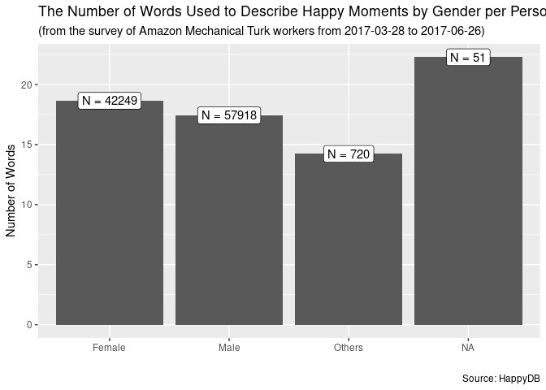
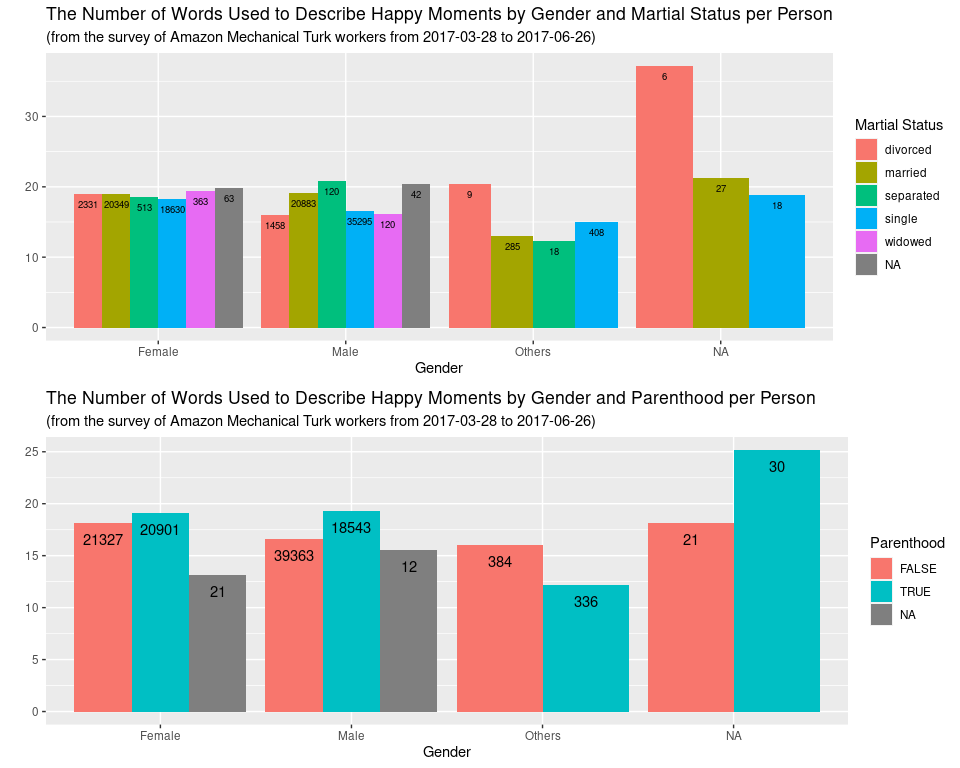
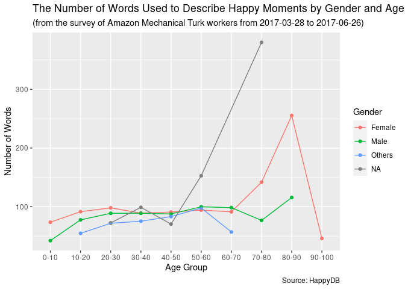
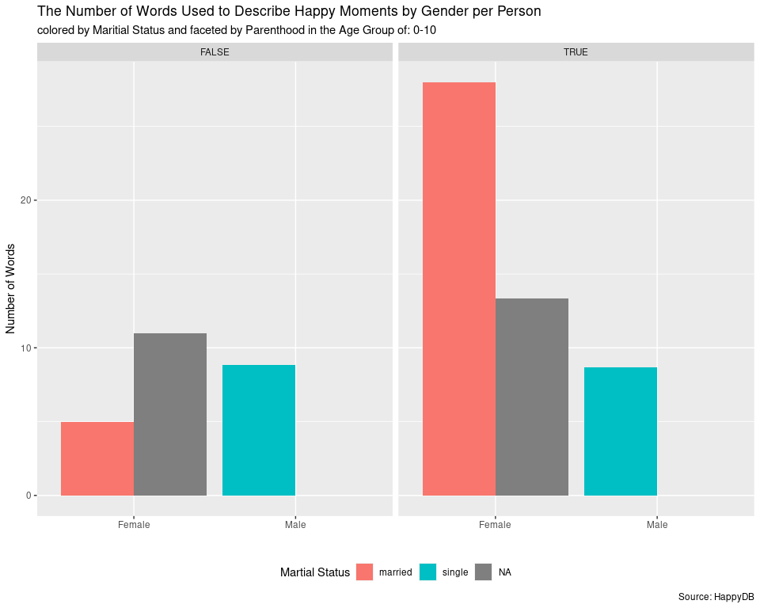
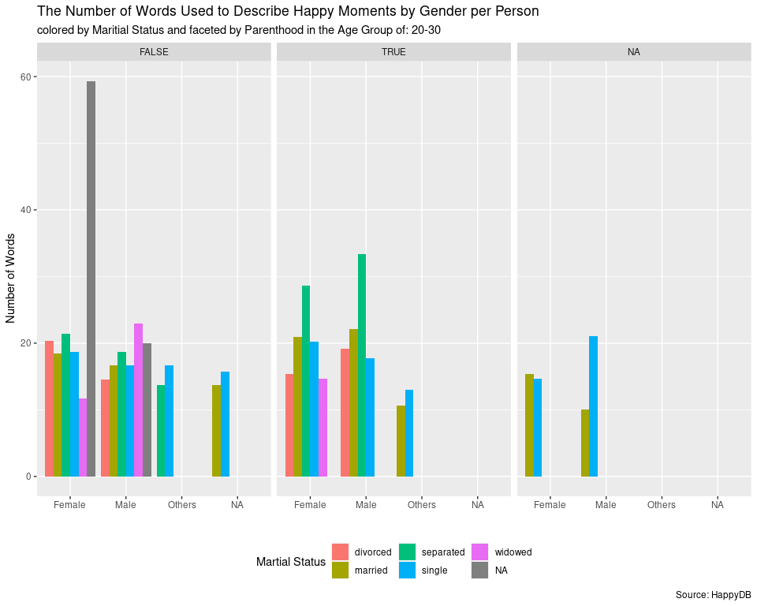
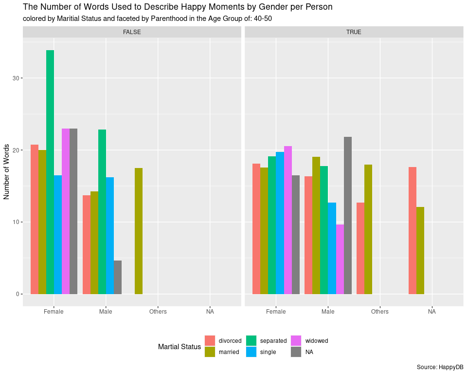
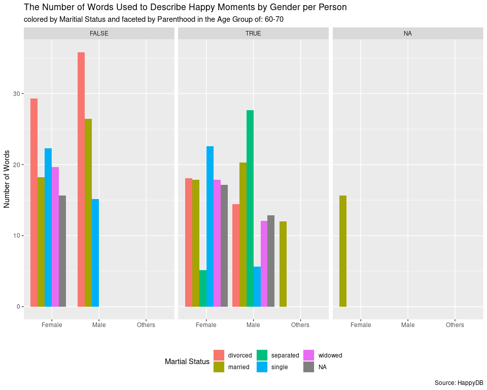
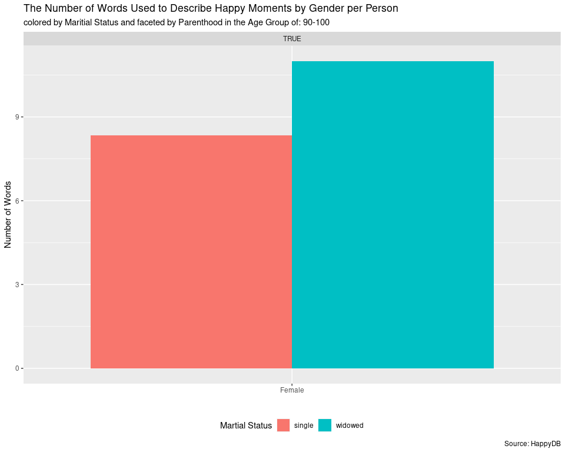

Analysis of Gendered Hapiness by the Number of Words Used to Descripe
Happy Moments
================
Boseong Yun
5/18/2020

# How I obatined and selected the dataset?

I have previously visited Kaggle, Harvard Dataverse, ICPSR, and other
U.S government webiste to look for data. However, many datasets were
often too extensive, too sepcific, and perhaps quite formal. I wish I
had the capabilites to analyze them (more computing courses…)\!
Additionally, I knew I had to select the data that gave me good
goosebumps as a social scientist as noted in “Aim Higher Section” of the
homework. I was able to navigate my way through [Data is
Plural](https://docs.google.com/spreadsheets/d/1wZhPLMCHKJvwOkP4juclhjFgqIY8fQFMemwKL2c64vk/edit#gid=0)
website that is kindly listed on the homework webpage. After scrolls and
downloads, I was fortunate to find
[HappyDB](https://github.com/megagonlabs/HappyDB) that contains more
than 10 thousand crowd-sourced happy moments. I have always wanted to do
reserach that quantifies unstructured data about subtle human
interactions, which I have previously stated in my
[hw01](https://github.com/boseongyun/hw01). I knew this was what I was
looking for\!

# Data Description

The data has been collected over 3 months on Amazon Mechnical Turk
(MTurk) workers by asking the workers to describe 3 happy moments in the
past 24 hours (or past 3 months) in textual form from 2017/03/28 to
2017/06/16. The data has been collected by HappyDB with the purpose of
finding the cause of happiness. In the github repo, the author has
released **cleaned\_hm.csv, original\_hm.csv, demographics.csv, and
senselabel.csv**. I have only chosen **original\_hm.csv** and
**demographics.csv** that include information about description of
moments and demographic information about the participants. The other
files that I have excluded form this project includes variables where
some level of analysis has already been done. For instance, in the
**cleaned\_hm.csv** file, there are 6 more columns that in fact are the
output of cleaning and analysis of the original analysis. I have thus
decided to use **original\_hm.csv** and **demographics.csv** to make my
own analysis. If you want detailed information about the dataset, visit
[HappyDB](https://github.com/megagonlabs/HappyDB).

In the **original\_hm.csv** file, the variables are:

  - hmid (int): Happy moment ID
  - wid (int): Worker ID
  - hm (str): Original happy moment
  - reflection\_period (str): Reflection period used in the instructions
    provided to the worker (3m or 24h)

In the **demographic.csv** file, the variaables are:

  - wid (int): Worker ID
  - age (float): Age
  - country (str): Country of residence (follows the ISO 3166 Country
    Code)
  - gender (str): {Male (m), Female (f), Other (o)}
  - marital (str): Marital status {single, married, divorced, separated,
    or widowed}
  - parenthood (str): Parenthood status {yes (y) or no (n)}

# Introduction to my project on gendered happiness

Happiness can mean many things to many different people. Some tend to be
rough, some tend to be seasoned, and some tend to be a mixture of both.
It is indeed amazing to see how people grow old with it. Despite its
seemingly mystic form, I aim to analyze gendered patterns in one’s
description of happiness. Specifically, I intend to find how one’s
perspectives of happiness can be affected by gender at the intersection
of age, maritial status, parenthood experiences through studying the
number of words used to describe their happiness.

# Data Analysis

**Analysis 1 - Does gender affeect the number of words used to describe
happy moments?** The EDA shows that the number of words used to describe
happy moments per person by gender does not yield any meaningful
difference between men and women. While femalse use more number of
wrods, they do not seem to be using significantly more words than males
at least in describing happiness in this study. This small difference
might come from different ways females and males socialize with people.
For instance, females are more likely to spend time in activities that
require more words than men. It is interesting to note, however, that
those who have have identifeid themselves as others were the least
likely to describe happiness using many words. Additionally, those who
belong to the NA category were the most likely to describe happiness
using many words. Although lack of documentation on NA value in the
gender category allows presumptions at best, the binary gender model
seems to be limited in terms of explaining gendered differences in this
analysis. For instance, both Others and NA groups differed by 26 and 17
percents while Male and Female groups differed only by 3 percents from
the average number of words used to describe happy moments across
groups. It might be the case that they could have lived under different
circumstances where they could not openly describe about themselves and
thus show differences in the number of words used. Also, it could be the
case that they spent a lot of time thinkig about happiness living as a
minority and thus could have a solidifed answer to the question in
different legnths. From this result, we can suspect that gender does
affect how one expresses happy moments using
language.

<!-- -->

| Gender | Number of People | Word Count | Word Count per Person | Avearge Word Count per Person Across Groups | Difference in Percents |
| :----- | ---------------: | ---------: | --------------------: | ------------------------------------------: | ---------------------: |
| Female |            42249 |     787912 |              18.64925 |                                     18.1457 |              0.0270008 |
| Male   |            57918 |    1009665 |              17.43266 |                                     18.1457 |            \-0.0409024 |
| Others |              720 |      10243 |              14.22639 |                                     18.1457 |            \-0.2754960 |
| NA     |               51 |       1136 |              22.27451 |                                     18.1457 |              0.1853602 |

**Analysis 2 - Does gender at the intersection of parenthood and
marriage affeect the number of words used to describe happy moments?**
The EDA shows that the number of words used to describe happy moments
per person by gender and marital status does not vary significnatly
among male and females. Although there is a slight tendency for males
with separated, married, and NA maritial status to use more words, they
do not deviate significant form the average. It is interesting to note
that for those who belong to Others and NA, they do not belong to some
of the maritial categories previously applied to male and female groups
such as widowed and separated. While this might be due to the fact that
there is small sample size for those groups, this indicates that our
cultural and social institutions that define human relationship may not
fully reflect its diversity across different groups. Within Others and
NA gender categories, those whose maritial status is divorced tends to
speak significantly more than other people in the same groups and across
other groups. It may be the case that it is not easy to find maritial
partners for them and thus divorce carries relatively more weight in
changing how one experiences and expresses happy moments. The status of
parenthood increases the number of words used to describe happy moments
for male and female, and NA groups. The reverse is true for the others
group. This perplexing pattern seems to need further reserach to find
its cause. It might be the case, howeverm, that the relationship between
the number of words used to describe happy moments and maritial status
is spurious. For instance, people with divorced and separated maritial
status could simply had more time to focus on their meories and thus
could have used the time to find more words to describe
happiness.

<!-- -->

**Analysis 3.1 - Does gender at the intersection of age affect the
number of words used to describe happy moments?** The following graph
provide an overview of how age affects the number of words used to
describe happy moments in each gender category. For instance, we can
find that there is a slight positive assocation with age and the number
of words used to describe happy moments for each gender category.
Although it is true that each gender category has its own reflection
point, they show similar trends and thus age does not seem to produce
meaningful difference for each gender category. This might be because
people find more happy moments as they develop more sophisticated taste
of happiness and learn words used to describe them with age. Also, it
could be that gender may lose its distintive role as the source of
difference, if not discrimination, over age. On the side note, it
interesting to find the apperance of Others and NA gender categories as
the age-cohort progresses. It could be the case that people start to
find about their gender identities as they enter into adolesence. It is
also of little joy to see for those who belong to Others gender category
increasingly find more words to describe happy moments.

<!-- -->

**Conclusion - Does gender at the intersection of age, martial status,
and parenthood affect the number of words used to describe happy
moments?** The analysis of the impact of gender at the intersction of
the intersection of maritial status, parenthood experiences, and age
groups indicate layered results. First of all, we were able to see that
gender does affect the number of words used to describe happy moment in
general. There were siginificant differnces in the number of words used
to describe happy moments for those in others and NA gender categories.
At the intersectioin of maritial status, however, it was suspected of
spurious relationship where maritial status could be corrleated with
time. At the intesection of parenthood, gender did show its distinct
pattern where those who belonged to others categories used less words
when they were parents.

**Food for thought: How does the impact of gender change at multiple
intersections?** The following complex plots indicate that gender is
more than one encompassing cateogory. In other words, gender, despite
its distinctive pattern, is nonetheless subject to other social and
cultural influences that wihtout careful attention can easily lose its
explanatroy power as a dependent variable. One could use multivarite
regression methods to quantify the diminishing explanatory power of
gender as age, martial status, and parenthood affect are added and held
constant. For instance, females in the age group of 80-90 is most
reflective of only single women without parenthood experiences among
many other cases. Specifically, the difference in the number of words
used to describe happy moments between single female group without
parenthood experiences and married female group with parenthood
experiences is about 450 words per person. We then may have to ask
ourselves whether gender that we have initially set out to study is
still the same thing
afterwards.

    ## [[1]]

<!-- -->

    ## 
    ## [[2]]

<!-- -->

    ## 
    ## [[3]]

<!-- -->

    ## 
    ## [[4]]

<!-- -->

    ## 
    ## [[5]]

<!-- -->

    ## 
    ## [[6]]

<!-- -->

# Limitations of the project

Despite extensive number of data with detailed coding book generoulsy
provided by HappyDB, the data issued for this project has issues.
**First of all**, there is lack of documentation on the NA value in the
gender category. Without proper explanations, I could only make partial
analysis about NA values in this project. Due to the project’s focus on
gender, I have not excluded NA values and treated it as a seperate
caegory. This inherently creates room for potential misunderstanding.
**Secondly**, the conclusions from this project might not be applicable
to other groups due to the nature of where and how the data was
collected. For instance, there might be potential bias in the analysis
since the data was collected from Amazon Mechanical Workers whose
profession tends to have gender imbalances as presented in many
empirical studies. **Thirdly**, some of the data for the age groups of
0-10 and above 50 may not have been filled out by themselves. This can
cause some measurement error. **Lastly**, the analysis is limited to the
number of words used to describe happiness. *Future studies* may include
finding gendered patterns by breaking the number of words into nouns,
adjectives, and verbs. Also, some studies may study the number of
special characters such as exclamation marks and questions marks. It
will also be interesting to study the tense of the grammar to see
whether happiness is memorized in the past tense, present tense, or
future tense.
