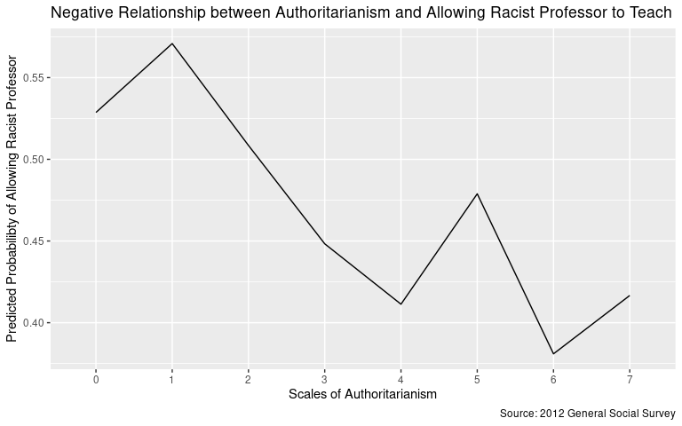
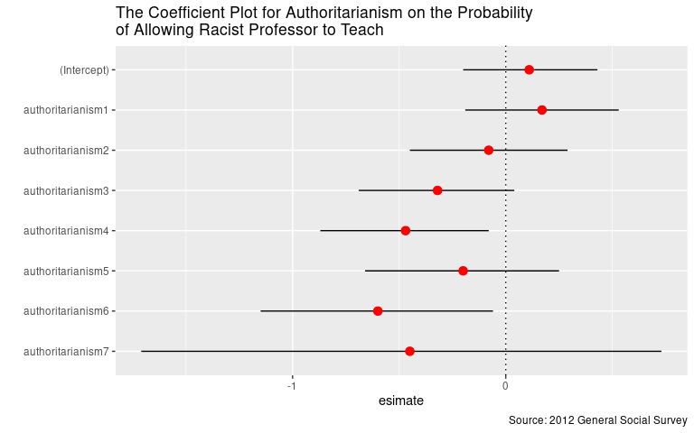
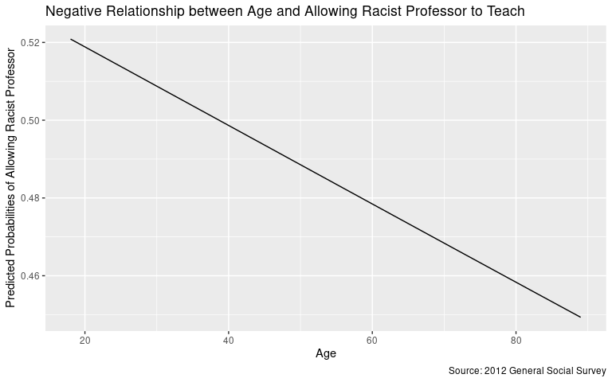
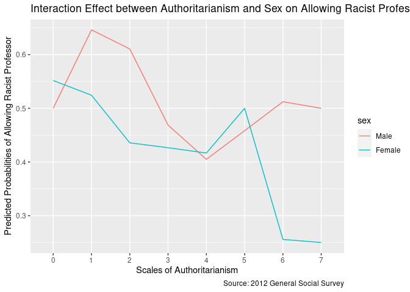
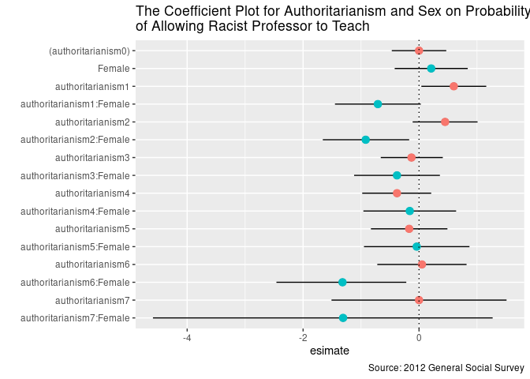
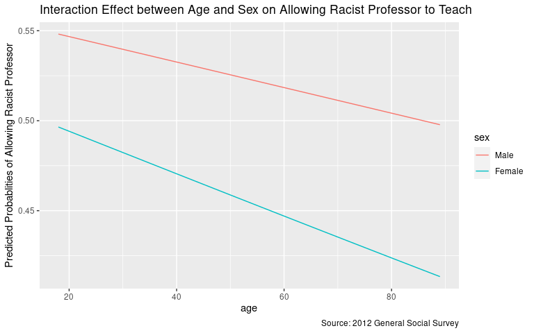

Predicting attitudes towards racist college professors
================
Boseong Yun
2020-05-25

### Introduction:

  - In this project, I use the authoritarianism and age variables with
    their interaction effects with the sex variable to predict whether
    respondents believes that a racist professor should be allowed to
    teach or not. To find out the predictive capabilities, I regress
    colrac on authoritarianism and age separately and also with the sex
    variable added.

  - I predict that authortarianism are going to be positively associated
    with the colrac variable. In other words, higher levels of
    authoritarianism are associated with the belief that a racist
    professor should be allowed to teach. I suspect postive relationship
    because racism that is based on the restrictive definition of race
    seems to be similiar to authoritarianism. For age, I predict that it
    is also going to be positively associated with colrac variable. That
    is, older people are more likely to believe that racists should be
    aolowed to teach. I suspect positive relationship because old people
    are less likely to have received education and experienced
    diversities than young people. Finally, I predict that females are
    less likely to approve racist professors to teach than the male
    counterparts because higher proportions of female receive college
    education where they learn about injustice held in
racism.

### Logistic Regression 1: The Relationship between authoritarianism and the likelihood of beliving that a racist professor should be allowed to teach.

  - **EDA**: The following graphs show that there is a small negative
    relationship between levels of authoritarianism and the likelihood
    of believing that a racist professor should be allowed to teach.
    That is, an increase in the level of authoritarianism is associated
    with less likelihood of believing that racists professor should be
    allowed to teach. The visualization of the coefficient shows that
    while higher levels of authoritarianism are associated with higher
    likelihood of believing that the racist professor should not be
    allowed to teach on average, they are not always consistent. These
    patterns are not as expected since I initally thought that people
    with authoritarian values could also be racists. It might be the
    case that people with authoritarian values have their own protected
    ideas and thus are not receptive to any
idea

<!-- --><!-- -->

  - **Regression**: The regression output shows that only
    authoritarinism with level 4 and 6 are statistically siginificant at
    the 95% confidence levels. In other words, we fail to reject the
    null hypothesis that the effect of authoritarinism with levels of 0,
    1, 2, 3, and 5 are not statistically different from 0 at the 95%
    confidence levels. The coefficient on level 4 and level 6 indicate
    that people are 47 and 60 percent less likely to allow racist
    professors to teach
respectively.

| Variable          | Estimate | Standard Error | T Stat | P-Value | Lower 95% | Upper 95% |
| :---------------- | -------: | -------------: | -----: | ------: | --------: | --------: |
| (Intercept)       |     0.11 |           0.16 |   0.72 |    0.47 |    \-0.20 |      0.43 |
| authoritarianism1 |     0.17 |           0.19 |   0.92 |    0.36 |    \-0.19 |      0.53 |
| authoritarianism2 |   \-0.08 |           0.19 | \-0.43 |    0.67 |    \-0.45 |      0.29 |
| authoritarianism3 |   \-0.32 |           0.19 | \-1.73 |    0.08 |    \-0.69 |      0.04 |
| authoritarianism4 |   \-0.47 |           0.20 | \-2.33 |    0.02 |    \-0.87 |    \-0.08 |
| authoritarianism5 |   \-0.20 |           0.23 | \-0.86 |    0.39 |    \-0.66 |      0.25 |
| authoritarianism6 |   \-0.60 |           0.28 | \-2.18 |    0.03 |    \-1.15 |    \-0.06 |
| authoritarianism7 |   \-0.45 |           0.61 | \-0.74 |    0.46 |    \-1.71 |      0.73 |

Table 1: Regression Output - Whether Racist Professors Should be Allowed
to
Teach

### Logistic Regression 2: The Relationship between age and the likelihood of beliving that a racist professor should be able to teach or not.

  - **EDA**: The graph shows that there is a negative realtionship
    between age and the likelihood of beliving that racist professors
    should be allowed to teach. That is, old people are more likley to
    reject racist professors. This trend is different from what I
    expected because I initially thought that old people were less
    likely to receive college education and diversiteis and thus were
    more likely to approve of racist professors. This might be because
    the old generation lived through historic civil movements and thus
    know the terrible consequences of racism. It is intersting how
    younger people are more likely to approve racist professors\!

<!-- -->

  - **Regression**: The regression output shows that age is not
    statistically associated with the belief that racist professors
    should be allowed to teach. The high p-value suggests that we fail
    to reject the null hypothesis that age does not reduce the
    likelihood of beliving that racist professors should be allowed to
    teach. It is important to note, however, that this regression output
    may be baised due to potential omitted variable biases such as
    income and education
levels.

| Variable    | Estimate | Standard Error | T Stat | P-Value | Lower 95% | Upper 95% |
| :---------- | -------: | -------------: | -----: | ------: | --------: | --------: |
| (Intercept) |     0.16 |           0.13 |   1.19 |    0.23 |    \-0.10 |      0.41 |
| age         |     0.00 |           0.00 | \-1.58 |    0.11 |    \-0.01 |      0.00 |

Table 2: Regression Output - Whether Racist Professors Should be Allowed
to Teach

### Multiple Logistic Regression with Authoritarianism and Sex

  - **EDA**: The graphs indicate that Males are more likely to allow
    racist professors to teach than the female counterparts across
    different scales of authoritarianism. For instance, males exhibit
    significantly higher likelihood of accpeting racist professors to
    teach across every level except 4 and 5 in the scales of
    authoritarianism. The coefficient plot shows that only two
    interaction variables are statistically significant. That is,
    females with the level 2 and 6 authoritarianism are statistically
    sigificant with higher probabilities of rejecting the racist
    progessors.

<!-- --><!-- -->

  - **Regression**: The regression outputs indicate that most of the
    interaction effects are not statistically significant. That is, we
    fail to reject the null hypothesis that females are less likely to
    reject racist professors at the level of 0, 1, 3, 4, and 5 of
    authoritarianism. Neverthelss, the coefficient on the interaction
    effects with level 2 and 6 of authoritarianism indicate that being a
    female reduces the likelihood of allowing the racist professors to
    teach by 92% and 132% from those of the male conterparts. I believe
    that these figures are incorrect and suffer from omitted variable
    biases because the probabliby should not exceed
1.

| Variable                 | Estimate | Standard Error | T Stat | P-Value | Lower 95% | Upper 95% |
| :----------------------- | -------: | -------------: | -----: | ------: | --------: | --------: |
| (authoritarianism0)      |     0.00 |           0.24 |   0.00 |    1.00 |    \-0.47 |      0.47 |
| authoritarianism1        |     0.60 |           0.29 |   2.11 |    0.04 |      0.04 |      1.16 |
| authoritarianism2        |     0.45 |           0.29 |   1.57 |    0.12 |    \-0.11 |      1.01 |
| authoritarianism3        |   \-0.13 |           0.27 | \-0.46 |    0.65 |    \-0.66 |      0.41 |
| authoritarianism4        |   \-0.38 |           0.30 | \-1.27 |    0.20 |    \-0.98 |      0.21 |
| authoritarianism5        |   \-0.17 |           0.34 | \-0.50 |    0.62 |    \-0.83 |      0.49 |
| authoritarianism6        |     0.05 |           0.39 |   0.12 |    0.90 |    \-0.72 |      0.82 |
| authoritarianism7        |     0.00 |           0.75 |   0.00 |    1.00 |    \-1.51 |      1.51 |
| Female                   |     0.21 |           0.32 |   0.65 |    0.52 |    \-0.42 |      0.84 |
| authoritarianism1:Female |   \-0.71 |           0.38 | \-1.89 |    0.06 |    \-1.45 |      0.03 |
| authoritarianism2:Female |   \-0.92 |           0.38 | \-2.40 |    0.02 |    \-1.66 |    \-0.17 |
| authoritarianism3:Female |   \-0.38 |           0.38 | \-1.01 |    0.31 |    \-1.12 |      0.36 |
| authoritarianism4:Female |   \-0.16 |           0.41 | \-0.39 |    0.70 |    \-0.96 |      0.64 |
| authoritarianism5:Female |   \-0.04 |           0.47 | \-0.09 |    0.93 |    \-0.95 |      0.87 |
| authoritarianism6:Female |   \-1.32 |           0.57 | \-2.33 |    0.02 |    \-2.46 |    \-0.22 |
| authoritarianism7:Female |   \-1.31 |           1.39 | \-0.94 |    0.35 |    \-4.59 |      1.27 |

Table 3: Regression Output - Whether Racist Professors Should be Allowed
to Teach

## Multiple Logistic Regression with Age and Sex

  - **EDA**: The graph indicates that females are more likely to reject
    racist professors than the male counterparts in each age. It is also
    interesting to note that the difference in probabilities widen with
    more age. This is pattern is partialy in consitent with my initial
    prediction that females are more likley to reject racist professors
    as they recive more college educaton and experience diversities.
    Howeveer, it fails to explain the difference in groups with age
    greater than 60 where females had liimted access to college
    education. The difference might be due to the fact that females tend
    to be more social and generous with differences among people.

<!-- -->

  - **Regression**: The regression output indicates that none of the
    variables, including the interaction variables, are statistically
    significant at the 95% confidence level. These can be found in the
    realtively high p-value. Thus, we fail to reject establish
    statistical relationship
between

| Variable   | Estimate | Standard Error | T Stat | P-Value | Lower 95% | Upper 95% |
| :--------- | -------: | -------------: | -----: | ------: | --------: | --------: |
| (Male)     |     0.24 |           0.19 |   1.26 |    0.21 |    \-0.14 |      0.63 |
| age        |     0.00 |           0.00 | \-0.74 |    0.46 |    \-0.01 |      0.00 |
| Female     |   \-0.17 |           0.26 | \-0.66 |    0.51 |    \-0.69 |      0.34 |
| age:Female |     0.00 |           0.01 | \-0.37 |    0.71 |    \-0.01 |      0.01 |

Table 4: Regression Output - Whether Racist Professors Should be Allowed
to
    Teach

## Session info

    ## ─ Session info ───────────────────────────────────────────────────────────────
    ##  setting  value                               
    ##  version  R version 3.6.3 (2020-02-29)        
    ##  os       Red Hat Enterprise Linux 8.1 (Ootpa)
    ##  system   x86_64, linux-gnu                   
    ##  ui       X11                                 
    ##  language (EN)                                
    ##  collate  en_US.UTF-8                         
    ##  ctype    en_US.UTF-8                         
    ##  tz       America/Chicago                     
    ##  date     2020-05-25                          
    ## 
    ## ─ Packages ───────────────────────────────────────────────────────────────────
    ##  package      * version   date       lib source                        
    ##  assertthat     0.2.1     2019-03-21 [2] CRAN (R 3.6.3)                
    ##  backports      1.1.5     2019-10-02 [2] CRAN (R 3.6.3)                
    ##  boot           1.3-24    2019-12-20 [2] CRAN (R 3.6.3)                
    ##  brnn           0.8       2020-01-08 [1] CRAN (R 3.6.3)                
    ##  broom        * 0.5.5     2020-02-29 [2] CRAN (R 3.6.3)                
    ##  callr          3.4.3     2020-03-28 [2] CRAN (R 3.6.3)                
    ##  cellranger     1.1.0     2016-07-27 [2] CRAN (R 3.6.3)                
    ##  cli            2.0.2     2020-02-28 [2] CRAN (R 3.6.3)                
    ##  colorspace     1.4-1     2019-03-18 [2] CRAN (R 3.6.3)                
    ##  crayon         1.3.4     2017-09-16 [2] CRAN (R 3.6.3)                
    ##  Cubist         0.2.3     2020-01-10 [1] CRAN (R 3.6.3)                
    ##  data.table     1.12.8    2019-12-09 [2] CRAN (R 3.6.3)                
    ##  DBI            1.1.0     2019-12-15 [2] CRAN (R 3.6.3)                
    ##  dbplyr         1.4.2     2019-06-17 [2] CRAN (R 3.6.3)                
    ##  dendroTools  * 1.0.7     2020-01-07 [1] CRAN (R 3.6.3)                
    ##  desc           1.2.0     2018-05-01 [2] CRAN (R 3.6.3)                
    ##  devtools       2.2.2     2020-02-17 [2] CRAN (R 3.6.3)                
    ##  digest         0.6.25    2020-02-23 [2] CRAN (R 3.6.3)                
    ##  dplyr        * 0.8.5     2020-03-07 [2] CRAN (R 3.6.3)                
    ##  ellipsis       0.3.0     2019-09-20 [2] CRAN (R 3.6.3)                
    ##  evaluate       0.14      2019-05-28 [2] CRAN (R 3.6.3)                
    ##  fansi          0.4.1     2020-01-08 [2] CRAN (R 3.6.3)                
    ##  farver         2.0.3     2020-01-16 [2] CRAN (R 3.6.3)                
    ##  forcats      * 0.5.0     2020-03-01 [2] CRAN (R 3.6.3)                
    ##  Formula        1.2-3     2018-05-03 [2] CRAN (R 3.6.3)                
    ##  fs             1.4.0     2020-03-31 [2] CRAN (R 3.6.3)                
    ##  generics       0.0.2     2018-11-29 [2] CRAN (R 3.6.3)                
    ##  ggplot2      * 3.3.0     2020-03-05 [2] CRAN (R 3.6.3)                
    ##  glue           1.3.2     2020-03-12 [2] CRAN (R 3.6.3)                
    ##  gridExtra      2.3       2017-09-09 [2] CRAN (R 3.6.3)                
    ##  gsw            1.0-5     2017-08-09 [1] CRAN (R 3.6.3)                
    ##  gtable         0.3.0     2019-03-25 [2] CRAN (R 3.6.3)                
    ##  haven          2.2.0     2019-11-08 [2] CRAN (R 3.6.3)                
    ##  here         * 0.1       2017-05-28 [1] CRAN (R 3.6.3)                
    ##  highr          0.8       2019-03-20 [2] CRAN (R 3.6.3)                
    ##  hms            0.5.3     2020-01-08 [2] CRAN (R 3.6.3)                
    ##  htmltools      0.4.0     2019-10-04 [2] CRAN (R 3.6.3)                
    ##  htmlwidgets    1.5.1     2019-10-08 [2] CRAN (R 3.6.3)                
    ##  httr           1.4.1     2019-08-05 [2] CRAN (R 3.6.3)                
    ##  jsonlite       1.6.1     2020-02-02 [2] CRAN (R 3.6.3)                
    ##  knitr        * 1.28      2020-02-06 [2] CRAN (R 3.6.3)                
    ##  labeling       0.3       2014-08-23 [2] CRAN (R 3.6.3)                
    ##  lattice        0.20-38   2018-11-04 [2] CRAN (R 3.6.3)                
    ##  lazyeval       0.2.2     2019-03-15 [2] CRAN (R 3.6.3)                
    ##  lifecycle      0.2.0     2020-03-06 [2] CRAN (R 3.6.3)                
    ##  lubridate      1.7.4     2018-04-11 [2] CRAN (R 3.6.3)                
    ##  magrittr       1.5       2014-11-22 [2] CRAN (R 3.6.3)                
    ##  MASS           7.3-51.5  2019-12-20 [2] CRAN (R 3.6.3)                
    ##  memoise        1.1.0     2017-04-21 [2] CRAN (R 3.6.3)                
    ##  MLmetrics      1.1.1     2016-05-13 [1] CRAN (R 3.6.3)                
    ##  mnormt         1.5-6     2020-02-03 [2] CRAN (R 3.6.3)                
    ##  modelr       * 0.1.6     2020-02-22 [2] CRAN (R 3.6.3)                
    ##  munsell        0.5.0     2018-06-12 [2] CRAN (R 3.6.3)                
    ##  nlme           3.1-144   2020-02-06 [2] CRAN (R 3.6.3)                
    ##  oce            1.2-0     2020-02-21 [1] CRAN (R 3.6.3)                
    ##  pillar         1.4.3     2019-12-20 [2] CRAN (R 3.6.3)                
    ##  pkgbuild       1.0.6     2019-10-09 [2] CRAN (R 3.6.3)                
    ##  pkgconfig      2.0.3     2019-09-22 [2] CRAN (R 3.6.3)                
    ##  pkgload        1.0.2     2018-10-29 [2] CRAN (R 3.6.3)                
    ##  plotly         4.9.2.1   2020-04-04 [1] CRAN (R 3.6.3)                
    ##  plyr           1.8.6     2020-03-03 [2] CRAN (R 3.6.3)                
    ##  prettyunits    1.1.1     2020-01-24 [2] CRAN (R 3.6.3)                
    ##  processx       3.4.2     2020-02-09 [2] CRAN (R 3.6.3)                
    ##  ps             1.3.2     2020-02-13 [2] CRAN (R 3.6.3)                
    ##  psych          1.9.12.31 2020-01-08 [2] CRAN (R 3.6.3)                
    ##  purrr        * 0.3.3     2019-10-18 [2] CRAN (R 3.6.3)                
    ##  R6             2.4.1     2019-11-12 [2] CRAN (R 3.6.3)                
    ##  randomForest   4.6-14    2018-03-25 [2] CRAN (R 3.6.3)                
    ##  rcfss          0.1.9     2020-04-01 [2] Github (uc-cfss/rcfss@6dd8d8b)
    ##  Rcpp           1.0.4     2020-03-17 [2] CRAN (R 3.6.3)                
    ##  readr        * 1.3.1     2018-12-21 [2] CRAN (R 3.6.3)                
    ##  readxl         1.3.1     2019-03-13 [2] CRAN (R 3.6.3)                
    ##  remotes        2.1.1     2020-02-15 [2] CRAN (R 3.6.3)                
    ##  reprex         0.3.0     2019-05-16 [2] CRAN (R 3.6.3)                
    ##  reshape2       1.4.3     2017-12-11 [2] CRAN (R 3.6.3)                
    ##  rlang          0.4.5     2020-03-01 [2] CRAN (R 3.6.3)                
    ##  rmarkdown      2.1       2020-01-20 [2] CRAN (R 3.6.3)                
    ##  rprojroot      1.3-2     2018-01-03 [2] CRAN (R 3.6.3)                
    ##  rstudioapi     0.11      2020-02-07 [2] CRAN (R 3.6.3)                
    ##  rvest          0.3.5     2019-11-08 [2] CRAN (R 3.6.3)                
    ##  scales         1.1.0     2019-11-18 [2] CRAN (R 3.6.3)                
    ##  sessioninfo    1.1.1     2018-11-05 [2] CRAN (R 3.6.3)                
    ##  stringi        1.4.6     2020-02-17 [2] CRAN (R 3.6.3)                
    ##  stringr      * 1.4.0     2019-02-10 [2] CRAN (R 3.6.3)                
    ##  testthat       2.3.2     2020-03-02 [2] CRAN (R 3.6.3)                
    ##  tibble       * 3.0.0     2020-03-30 [2] CRAN (R 3.6.3)                
    ##  tidyr        * 1.0.2     2020-01-24 [2] CRAN (R 3.6.3)                
    ##  tidyselect     1.0.0     2020-01-27 [2] CRAN (R 3.6.3)                
    ##  tidyverse    * 1.3.0     2019-11-21 [2] CRAN (R 3.6.3)                
    ##  truncnorm      1.0-8     2018-02-27 [1] CRAN (R 3.6.3)                
    ##  usethis        1.5.1     2019-07-04 [2] CRAN (R 3.6.3)                
    ##  vctrs          0.2.4     2020-03-10 [2] CRAN (R 3.6.3)                
    ##  viridis        0.5.1     2018-03-29 [2] CRAN (R 3.6.3)                
    ##  viridisLite    0.3.0     2018-02-01 [2] CRAN (R 3.6.3)                
    ##  withr          2.1.2     2018-03-15 [2] CRAN (R 3.6.3)                
    ##  xfun           0.12      2020-01-13 [2] CRAN (R 3.6.3)                
    ##  xml2           1.3.0     2020-04-01 [2] CRAN (R 3.6.3)                
    ##  yaml           2.2.1     2020-02-01 [2] CRAN (R 3.6.3)                
    ## 
    ## [1] /home/boseongyun/R/x86_64-redhat-linux-gnu-library/3.6
    ## [2] /usr/lib64/R/library
    ## [3] /usr/share/R/library
