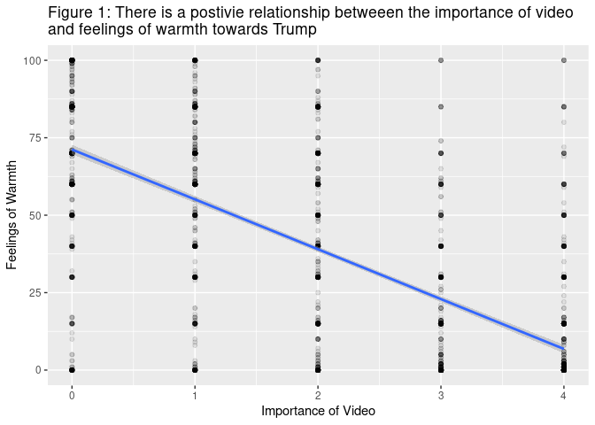
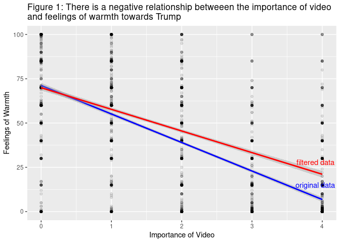
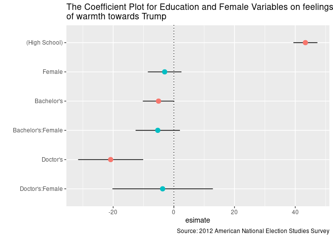
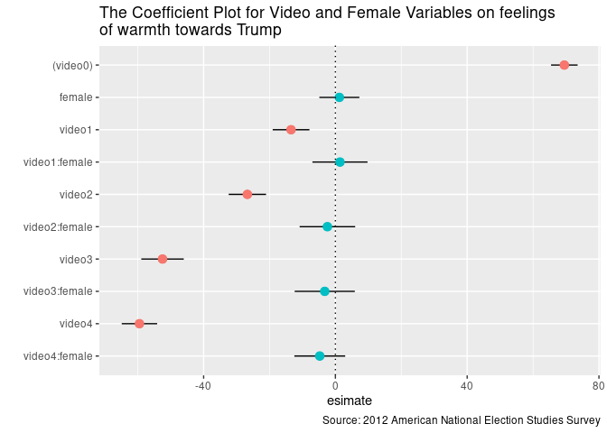
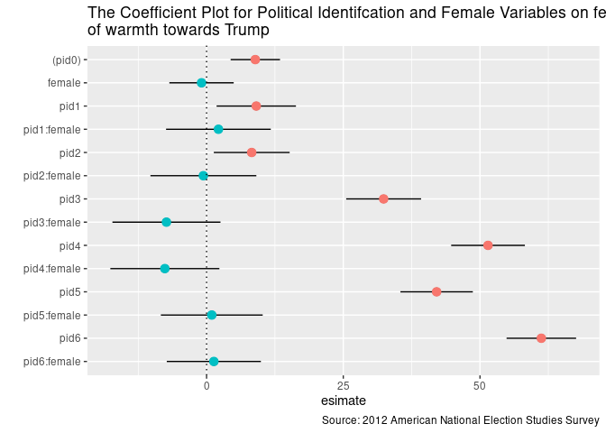

President Donald Trump
================
Boseong Yun
2020-05-25

## Part 1. Estimate a basic (single variable) linear regression model of the relationship between the importance of the video and feelings towards Donald Trump.

  - **Research Prediction**: Since the video contains footage of Donald
    Trump speaking vulgar language, I predict that the importance of the
    video is going to be negatively associated with the feelings towards
    Donald Trump.

  - **Exploratory Data Analysis**: The plot shows the distributiuon of
    feelings of warmth towards Trump across different levels of
    importance of the video felt by the viewers. *Plot 1* shows that
    higher levels of importance of the video is associated with colder
    responses towards Donald Trump. *Plot 2* where extreme levels of
    feelings, 0 and 100, towards Donald Trump have been omitted also
    show a smiliar negative trend with a slight change in the slope of
    the coefficient from the plot 1. These graphs indicate that the
    levels of importance are negative associated with the warm feelings
    towards
Trump

<!-- --><!-- -->

  - **Simple Linear Regression**: The coefficient on the video variable
    shows that a unit increase in the importance of video is
    statistically associated with a decrease of 16.0954 points of
    feelings of warmth towards Trump at the 95% confidence levels.
    Likewise, the coefficient on the intercept indicates that it is
    stastically significant that people who do not believe in the
    importance of video has 71.2008 points of feelings of warmth towards
    Trump. The t-staticis for both of the coefficients indicate that
    they are significant. Furthermore, the adjusted-R squared shows that
    the video variaible explains 47.96 percents of variation in the
    trump variable. The regression output for the filtered dataset also
    show statistically significant results with slight changed as
    indicated in the *Table
1*.

| Data | Variable    | Estimate | Standard Error |  T Stat | P-Value | Lower 95% | Upper 95% |
| :--- | :---------- | -------: | -------------: | ------: | ------: | --------: | --------: |
| 1    | (Intercept) |    71.20 |           0.78 |   91.37 |       0 |     69.67 |     72.73 |
| 1    | video       |  \-16.10 |           0.29 | \-54.57 |       0 |   \-16.67 |   \-15.52 |
| 2    | (Intercept) |    69.95 |           0.80 |   87.71 |       0 |     68.38 |     71.51 |
| 2    | video       |  \-12.22 |           0.36 | \-33.80 |       0 |   \-12.92 |   \-11.51 |

Table 1: Regression Output on the Feelings of Warmth Towards Trump

## Part 2:

The video contains elements that could be construed as sexist, if not
misogynistic, by many people. I would thus like to study gendered
patterns in the perception towards Trump. Specifically, I would like to
see the interaction effects of gender with levels of education,
importance of video, and political indentifications on the attitudes
towards Trump. I predict that female with higher levels of education are
going to have negative feelings on Trump. Also, I think that females who
belive that the video is important are more likely to hate Trump then
the male counterparts. For politicial identification, female who support
the Republicans are less likely to hate trump than those who support
Democrats. (I have limited the education levels to high school
graduates, Bahcelor’s, and Doctor’s to make infomred analyses based on
the documentation uploaded on the homework webpage in the entire
dataset)

### 2-1: Regression with Education and Female with their Interaction Effects

  - EDA: The graph shows that higher education levels seem to be
    associated with more negative feelings towards Trump. This is
    reasonable because people who have received higher education tend to
    dislike profanities and vulgaries. The interaction effect wtih
    gender also show that women are more likely to hate Trump than the
    male counterparts with the same level of education. For instance,
    the estimate for women in every level of education have negative
    average feelings towards Trump. It is important to note that the
    confidence intervals for these interaction effect show that women do
    not *always* hate Trump more than men. Despite the fact thay they
    are on average more likely to hate trump, the confidence interval
    lies both negative and positive including zero. Although this
    pattern where women on average are more likely to hate Trump is as
    expected, it is interesting to see that they are not always the
    case. There must be other control variables to see the effects more
    clearly.

<!-- -->

  - Regression: The regresion output shows that the coefficients for
    Bachelor’s and all the interaction variables are not statistically
    significant. In other words, we cannot reject the null hypothesis
    that female with higher levels of education are not statistically
    associated with colder attitudes towards Trump. These results are
    different from what I expected since I thought females with higher
    levels of education were going to be more sensitive to the
    wrongdoings of Trump. There must be more control variables such as
    race and income that could cause potential omitted variable bias to
    evaluate the interaction effect of gender with education
levels.

| Variable          | Estimate | Standard Error | T Stat | P-Value | Lower 95% | Upper 95% |
| :---------------- | -------: | -------------: | -----: | ------: | --------: | --------: |
| (High School)     |    43.36 |           2.01 |  21.52 |    0.00 |     39.41 |     47.32 |
| Bachelor’s        |   \-5.05 |           2.64 | \-1.91 |    0.06 |   \-10.23 |      0.13 |
| Doctor’s          |  \-20.83 |           5.46 | \-3.81 |    0.00 |   \-31.55 |   \-10.11 |
| Female            |   \-3.03 |           2.82 | \-1.07 |    0.28 |    \-8.57 |      2.51 |
| Bachelor’s:Female |   \-5.30 |           3.72 | \-1.42 |    0.15 |   \-12.61 |      2.00 |
| Doctor’s:Female   |   \-3.70 |           8.44 | \-0.44 |    0.66 |   \-20.25 |     12.86 |

Table 2: Regression Output on the Feelings of Warmth Towards Trump

### 2-2: Regression with Video and Female with their Interaction Effects

  - EDA: The graph shows a sbutle trend where women on averaege are more
    likely to hate trump than the male counterparts. For instance, the
    average coeffcient on the interaction variable between female and
    video move towards the negative value as the level of importance of
    video increases. This trend is as expected since those who believe
    that the videos are important tend to have high consciousness about
    gender issues and because women are being targeted in the video. As
    in the previous analysis, however, the confidence intervals for each
    interaction variable shows that women do not *always* hate Trump
    more than the male counterparts. Further variables such as race and
    income must be added to show the interaction effects more clearly.

<!-- -->

  - Regression: The regresion output shows that the coefficients for all
    the interaction variables between female and level of importance are
    not statistically significant. In other words, we cannot reject the
    null hypothesis that female who value the video more are not
    statistically associated with colder attitudes towards Trump. These
    results are different from what I expected since I thought females
    with stronger levels of importance about the video to be more
    sensitive to the wrongdoings of
Trump.

| Variable      | Estimate | Standard Error |  T Stat | P-Value | Lower 95% | Upper 95% |
| :------------ | -------: | -------------: | ------: | ------: | --------: | --------: |
| (video0)      |    69.49 |           2.05 |   33.84 |    0.00 |     65.46 |     73.52 |
| video1        |  \-13.46 |           2.84 |  \-4.73 |    0.00 |   \-19.04 |    \-7.88 |
| video2        |  \-26.72 |           2.89 |  \-9.25 |    0.00 |   \-32.39 |   \-21.05 |
| video3        |  \-52.48 |           3.29 | \-15.98 |    0.00 |   \-58.92 |   \-46.03 |
| video4        |  \-59.48 |           2.74 | \-21.71 |    0.00 |   \-64.86 |   \-54.11 |
| female        |     1.20 |           3.10 |    0.39 |    0.70 |    \-4.87 |      7.27 |
| video1:female |     1.39 |           4.26 |    0.32 |    0.75 |    \-6.98 |      9.75 |
| video2:female |   \-2.43 |           4.30 |  \-0.57 |    0.57 |   \-10.86 |      6.00 |
| video3:female |   \-3.24 |           4.65 |  \-0.70 |    0.49 |   \-12.37 |      5.89 |
| video4:female |   \-4.75 |           3.93 |  \-1.21 |    0.23 |   \-12.46 |      2.97 |

Table 3: Regression Output on the Feelings of Warmth Towards
Trump

### 2-3: Regression with Political Identification and Female with their Interaction Effects

  - EDA: The graph shows that there is a quadratic trend where the
    interaction effects between political identification and female
    variable. For instance, female with storng political identification
    either as a Democrat and Republican are more likely on average to
    have warm feelings towards Trump than those who have moderate
    political identifications. This is different from what I expected
    since I thought there was going to be a linear relationship where
    strong female Republicans are more likely to support Trump than
    strong female Democrats. This might be due to the fact that people
    who have strong political ideals are more likely to be concerned
    about national security and economy than other important national
    affairs. This graph also shows that none of the interaction effects
    are siginificant with their confidence intervals containing both
    positive and negative value including zero.

<!-- -->

  - Regression: The regresion output shows that the coefficients for all
    the interaction variables between female and political identifcation
    are not statistically significant. In other words, we cannot reject
    the null hypothesis that female who are strong Republicans are not
    statistically associated with warmer attitudes towards Trump. These
    results are different from what I expected since I thought females
    with stronger Reublican values would be more lenient twoards the
    wrongdoings of
Trump.

| Variable    | Estimate | Standard Error | T Stat | P-Value | Lower 95% | Upper 95% |
| :---------- | -------: | -------------: | -----: | ------: | --------: | --------: |
| (pid0)      |     8.91 |           2.30 |   3.87 |    0.00 |      4.40 |     13.43 |
| pid1        |     9.09 |           3.70 |   2.46 |    0.01 |      1.83 |     16.34 |
| pid2        |     8.25 |           3.54 |   2.33 |    0.02 |      1.32 |     15.19 |
| pid3        |    32.38 |           3.49 |   9.27 |    0.00 |     25.53 |     39.23 |
| pid4        |    51.47 |           3.43 |  14.99 |    0.00 |     44.73 |     58.21 |
| pid5        |    42.07 |           3.37 |  12.47 |    0.00 |     35.45 |     48.69 |
| pid6        |    61.22 |           3.24 |  18.88 |    0.00 |     54.86 |     67.58 |
| female      |   \-0.92 |           3.00 | \-0.31 |    0.76 |    \-6.81 |      4.96 |
| pid1:female |     2.17 |           4.88 |   0.44 |    0.66 |    \-7.41 |     11.74 |
| pid2:female |   \-0.59 |           4.94 | \-0.12 |    0.91 |   \-10.27 |      9.10 |
| pid3:female |   \-7.34 |           5.04 | \-1.46 |    0.15 |   \-17.22 |      2.54 |
| pid4:female |   \-7.63 |           5.08 | \-1.50 |    0.13 |   \-17.60 |      2.34 |
| pid5:female |     0.95 |           4.75 |   0.20 |    0.84 |    \-8.36 |     10.26 |
| pid6:female |     1.33 |           4.39 |   0.30 |    0.76 |    \-7.28 |      9.93 |

Table 4: Regression Output on the Feelings of Warmth Towards Trump

# Conclusion

Despite the fact that the video contains many elements that could be
construed as either sexist or misogynistic, none of the interaction
effects for female were statistically significant. These results were
rather surprising. Although not satistically significant, however, we
were still able to witness the changes in the patterns in which we found
females were less likely to view trump
    positively.

## Session info

    ## ─ Session info ───────────────────────────────────────────────────────────────
    ##  setting  value                               
    ##  version  R version 3.6.3 (2020-02-29)        
    ##  os       Red Hat Enterprise Linux 8.1 (Ootpa)
    ##  system   x86_64, linux-gnu                   
    ##  ui       X11                                 
    ##  language (EN)                                
    ##  collate  en_US.UTF-8                         
    ##  ctype    en_US.UTF-8                         
    ##  tz       America/Chicago                     
    ##  date     2020-05-25                          
    ## 
    ## ─ Packages ───────────────────────────────────────────────────────────────────
    ##  package      * version   date       lib source        
    ##  assertthat     0.2.1     2019-03-21 [2] CRAN (R 3.6.3)
    ##  backports      1.1.5     2019-10-02 [2] CRAN (R 3.6.3)
    ##  boot           1.3-24    2019-12-20 [2] CRAN (R 3.6.3)
    ##  brnn           0.8       2020-01-08 [1] CRAN (R 3.6.3)
    ##  broom        * 0.5.5     2020-02-29 [2] CRAN (R 3.6.3)
    ##  callr          3.4.3     2020-03-28 [2] CRAN (R 3.6.3)
    ##  cellranger     1.1.0     2016-07-27 [2] CRAN (R 3.6.3)
    ##  cli            2.0.2     2020-02-28 [2] CRAN (R 3.6.3)
    ##  colorspace     1.4-1     2019-03-18 [2] CRAN (R 3.6.3)
    ##  crayon         1.3.4     2017-09-16 [2] CRAN (R 3.6.3)
    ##  Cubist         0.2.3     2020-01-10 [1] CRAN (R 3.6.3)
    ##  data.table     1.12.8    2019-12-09 [2] CRAN (R 3.6.3)
    ##  DBI            1.1.0     2019-12-15 [2] CRAN (R 3.6.3)
    ##  dbplyr         1.4.2     2019-06-17 [2] CRAN (R 3.6.3)
    ##  dendroTools  * 1.0.7     2020-01-07 [1] CRAN (R 3.6.3)
    ##  desc           1.2.0     2018-05-01 [2] CRAN (R 3.6.3)
    ##  devtools       2.2.2     2020-02-17 [2] CRAN (R 3.6.3)
    ##  digest         0.6.25    2020-02-23 [2] CRAN (R 3.6.3)
    ##  dplyr        * 0.8.5     2020-03-07 [2] CRAN (R 3.6.3)
    ##  ellipsis       0.3.0     2019-09-20 [2] CRAN (R 3.6.3)
    ##  evaluate       0.14      2019-05-28 [2] CRAN (R 3.6.3)
    ##  fansi          0.4.1     2020-01-08 [2] CRAN (R 3.6.3)
    ##  farver         2.0.3     2020-01-16 [2] CRAN (R 3.6.3)
    ##  forcats      * 0.5.0     2020-03-01 [2] CRAN (R 3.6.3)
    ##  Formula        1.2-3     2018-05-03 [2] CRAN (R 3.6.3)
    ##  fs             1.4.0     2020-03-31 [2] CRAN (R 3.6.3)
    ##  generics       0.0.2     2018-11-29 [2] CRAN (R 3.6.3)
    ##  ggplot2      * 3.3.0     2020-03-05 [2] CRAN (R 3.6.3)
    ##  glue           1.3.2     2020-03-12 [2] CRAN (R 3.6.3)
    ##  gridExtra      2.3       2017-09-09 [2] CRAN (R 3.6.3)
    ##  gsw            1.0-5     2017-08-09 [1] CRAN (R 3.6.3)
    ##  gtable         0.3.0     2019-03-25 [2] CRAN (R 3.6.3)
    ##  haven          2.2.0     2019-11-08 [2] CRAN (R 3.6.3)
    ##  here         * 0.1       2017-05-28 [1] CRAN (R 3.6.3)
    ##  highr          0.8       2019-03-20 [2] CRAN (R 3.6.3)
    ##  hms            0.5.3     2020-01-08 [2] CRAN (R 3.6.3)
    ##  htmltools      0.4.0     2019-10-04 [2] CRAN (R 3.6.3)
    ##  htmlwidgets    1.5.1     2019-10-08 [2] CRAN (R 3.6.3)
    ##  httr           1.4.1     2019-08-05 [2] CRAN (R 3.6.3)
    ##  jsonlite       1.6.1     2020-02-02 [2] CRAN (R 3.6.3)
    ##  knitr        * 1.28      2020-02-06 [2] CRAN (R 3.6.3)
    ##  labeling       0.3       2014-08-23 [2] CRAN (R 3.6.3)
    ##  lattice        0.20-38   2018-11-04 [2] CRAN (R 3.6.3)
    ##  lazyeval       0.2.2     2019-03-15 [2] CRAN (R 3.6.3)
    ##  lifecycle      0.2.0     2020-03-06 [2] CRAN (R 3.6.3)
    ##  lubridate      1.7.4     2018-04-11 [2] CRAN (R 3.6.3)
    ##  magrittr       1.5       2014-11-22 [2] CRAN (R 3.6.3)
    ##  Matrix         1.2-18    2019-11-27 [2] CRAN (R 3.6.3)
    ##  memoise        1.1.0     2017-04-21 [2] CRAN (R 3.6.3)
    ##  mgcv           1.8-31    2019-11-09 [2] CRAN (R 3.6.3)
    ##  MLmetrics      1.1.1     2016-05-13 [1] CRAN (R 3.6.3)
    ##  mnormt         1.5-6     2020-02-03 [2] CRAN (R 3.6.3)
    ##  modelr       * 0.1.6     2020-02-22 [2] CRAN (R 3.6.3)
    ##  munsell        0.5.0     2018-06-12 [2] CRAN (R 3.6.3)
    ##  nlme           3.1-144   2020-02-06 [2] CRAN (R 3.6.3)
    ##  oce            1.2-0     2020-02-21 [1] CRAN (R 3.6.3)
    ##  pillar         1.4.3     2019-12-20 [2] CRAN (R 3.6.3)
    ##  pkgbuild       1.0.6     2019-10-09 [2] CRAN (R 3.6.3)
    ##  pkgconfig      2.0.3     2019-09-22 [2] CRAN (R 3.6.3)
    ##  pkgload        1.0.2     2018-10-29 [2] CRAN (R 3.6.3)
    ##  plotly         4.9.2.1   2020-04-04 [1] CRAN (R 3.6.3)
    ##  plyr           1.8.6     2020-03-03 [2] CRAN (R 3.6.3)
    ##  prettyunits    1.1.1     2020-01-24 [2] CRAN (R 3.6.3)
    ##  processx       3.4.2     2020-02-09 [2] CRAN (R 3.6.3)
    ##  ps             1.3.2     2020-02-13 [2] CRAN (R 3.6.3)
    ##  psych          1.9.12.31 2020-01-08 [2] CRAN (R 3.6.3)
    ##  purrr        * 0.3.3     2019-10-18 [2] CRAN (R 3.6.3)
    ##  R6             2.4.1     2019-11-12 [2] CRAN (R 3.6.3)
    ##  randomForest   4.6-14    2018-03-25 [2] CRAN (R 3.6.3)
    ##  Rcpp           1.0.4     2020-03-17 [2] CRAN (R 3.6.3)
    ##  readr        * 1.3.1     2018-12-21 [2] CRAN (R 3.6.3)
    ##  readxl         1.3.1     2019-03-13 [2] CRAN (R 3.6.3)
    ##  remotes        2.1.1     2020-02-15 [2] CRAN (R 3.6.3)
    ##  reprex         0.3.0     2019-05-16 [2] CRAN (R 3.6.3)
    ##  reshape2       1.4.3     2017-12-11 [2] CRAN (R 3.6.3)
    ##  rlang          0.4.5     2020-03-01 [2] CRAN (R 3.6.3)
    ##  rmarkdown      2.1       2020-01-20 [2] CRAN (R 3.6.3)
    ##  rprojroot      1.3-2     2018-01-03 [2] CRAN (R 3.6.3)
    ##  rstudioapi     0.11      2020-02-07 [2] CRAN (R 3.6.3)
    ##  rvest          0.3.5     2019-11-08 [2] CRAN (R 3.6.3)
    ##  scales         1.1.0     2019-11-18 [2] CRAN (R 3.6.3)
    ##  sessioninfo    1.1.1     2018-11-05 [2] CRAN (R 3.6.3)
    ##  stringi        1.4.6     2020-02-17 [2] CRAN (R 3.6.3)
    ##  stringr      * 1.4.0     2019-02-10 [2] CRAN (R 3.6.3)
    ##  testthat       2.3.2     2020-03-02 [2] CRAN (R 3.6.3)
    ##  tibble       * 3.0.0     2020-03-30 [2] CRAN (R 3.6.3)
    ##  tidyr        * 1.0.2     2020-01-24 [2] CRAN (R 3.6.3)
    ##  tidyselect     1.0.0     2020-01-27 [2] CRAN (R 3.6.3)
    ##  tidyverse    * 1.3.0     2019-11-21 [2] CRAN (R 3.6.3)
    ##  truncnorm      1.0-8     2018-02-27 [1] CRAN (R 3.6.3)
    ##  usethis        1.5.1     2019-07-04 [2] CRAN (R 3.6.3)
    ##  vctrs          0.2.4     2020-03-10 [2] CRAN (R 3.6.3)
    ##  viridis        0.5.1     2018-03-29 [2] CRAN (R 3.6.3)
    ##  viridisLite    0.3.0     2018-02-01 [2] CRAN (R 3.6.3)
    ##  withr          2.1.2     2018-03-15 [2] CRAN (R 3.6.3)
    ##  xfun           0.12      2020-01-13 [2] CRAN (R 3.6.3)
    ##  xml2           1.3.0     2020-04-01 [2] CRAN (R 3.6.3)
    ##  yaml           2.2.1     2020-02-01 [2] CRAN (R 3.6.3)
    ## 
    ## [1] /home/boseongyun/R/x86_64-redhat-linux-gnu-library/3.6
    ## [2] /usr/lib64/R/library
    ## [3] /usr/share/R/library
