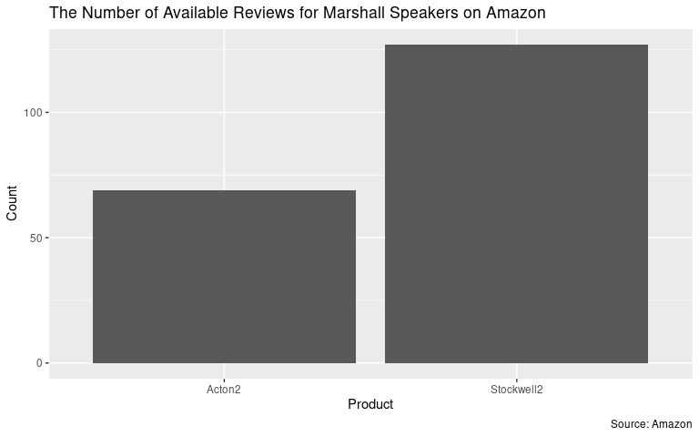
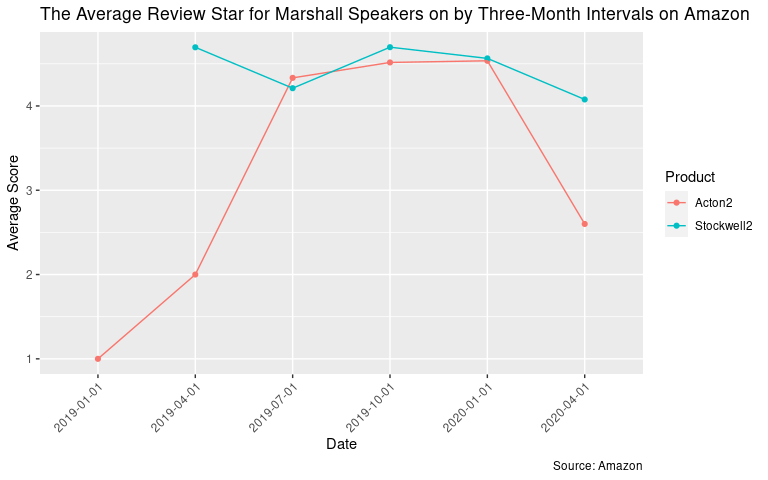
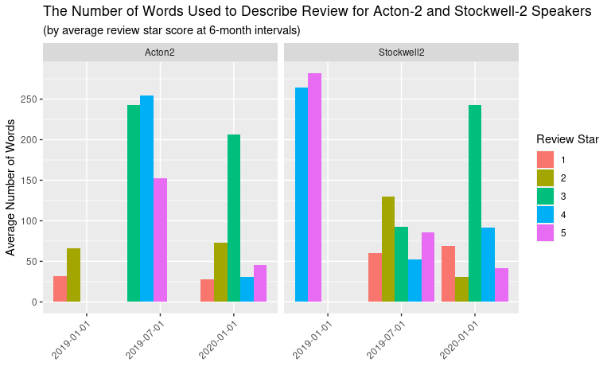
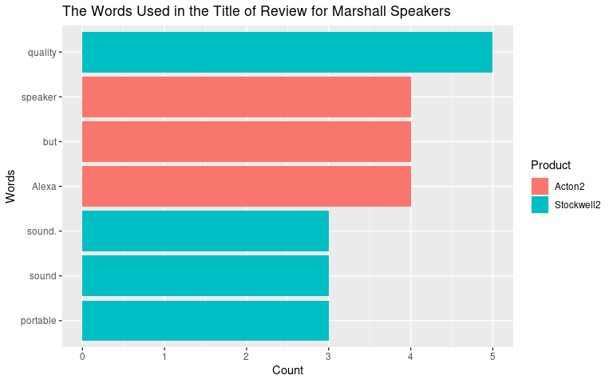
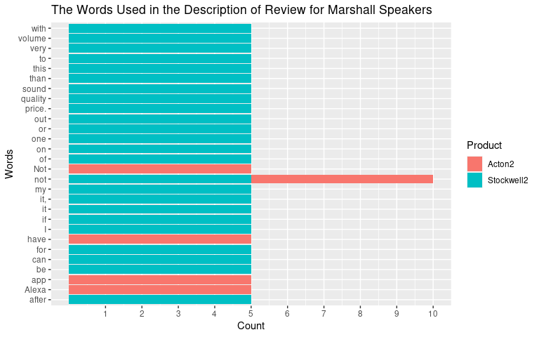

Homework 08: Part 2. Anaylsis using Webscraping from Amazon Review
================
Boseong Yun
2020-06-01

# Part 2. More complicated data collection

**Introduction**: In the era of COVID-19 pandemic, staying at home has
never been more important. Often times, staying home is easily said than
done. This is especially true due to sadness, anxities, and
uncertainties revolving around the world at this time. To maintain
emotional and spiritual stability in these times, one may consider
buying a speaker to listen to good music and relax one’s mind. In fact,
[businesswire](https://www.businesswire.com/news/home/20200513005670/en/Strategy-Analytics-8.2-Sales-Growth-Smart-Speakers)
reveals that the sales of speakers in 2020 Q1 increased 8.2% from 2019
Q1. In this project, I web-scrape and analzye the customer review from
Amazon on Marshall Stockwell 2 and Marshall Acton 2. This analysis may
provide provide useful information to potential consumers about which
speaker would be the best option. I have limited the brand to Marshall
due to its poularity and the products to Stockwell-2 and Acton-2 due to
the simliarity in the prices.

**Analysis 1**: The following plot shows that the number of reviews for
Stockwell-2 is almost double the number of reviews for Acton-2. This may
suggest that Stockwell-2 is a more popular product than Acton-2. It
could also mean that Stockwell-2 was released earlier than Acton-2.
These figures about the size of the reviews also provides useful
information used to understand the validity and robustness of analysis
being performed in the remainder of the report. Also from a consumer’s
perspectives, it is always better to have more reviews to make informed
decisions.

<!-- -->

**Analysis 2**: The following graph shows the average star score for
each product at three months interval beginning January, 2019. There are
a couple of things to notice about the graph. First of all, the lack of
data for Stockwell-2 in the first quarter of the year suggests that the
product could have been released after that period. In fact, Goolgle
Serach reveals that Stockwell-2 first became commerically available on
May 7, 2019 with Action-2 first becoming available on October 1, 2018.
Another thing to notice is that the average star score for Stockwell-2
is higher in every quarter except the period starting on July, 2019.
Most importantly, there is minimial variance in the average score for
Stockwell-2 compared to that of Acton-2. While more data with passing
time may prove otherwisedly, this graph shows that the consumer
satisfaction with Stockwell-2 speaker is likely to be higher also at
high precision.

<!-- -->

**Analysis 3**: The following shows the average number of words used in
the review for each product divided by the review star score over
6-month intervals. This graph provides interesting information about the
progression of the average number of words used in each reviewv star
socre. For instance, it can be seen that high number of average words
used to describe Stockwell-2 with only 4 and 5 levels in the beginning
of 2019 quickly decrease as time progresses. The flatter distribution in
each review star at the end of the 2019 and at the beginning of 2020
seem to reveal that the true review need be time-adjusted. Also, the
progression of the average numbers used in the review for Action-2 in
each star level shows that the product is being re-evaluated with more
time. Although there are many other factors such as price change, the
presence of substitues, and the credibility of the seller, this graph
provides valuable information about the change in the consumer
satisfcation of the product over time.

<!-- -->

**Analysis 4**: The following graph shows the specific words used in the
title of the review for each product. Since title tends to capture the
key information, analysis of words used in title can provide valuable
information. Although some of the words used in the title are not either
fully informative or require further contexts, the words used show some
key functionalities of each speaker. For instance, Acton-2 seems to
provide Alexa service and stockwell-2 seems to provide great
portability.

<!-- -->

**Analysis 5**: The following graph shows the words used in the
description of review for each speaker. Although the words used in the
description may prove useful to people without any knowledge about the
products being analyzed, these graphs fail to provide any substantive
information to potential buyers deciding between the two different
models. These graphs will look much better had the words been filtered
to adjectives or adverbs. Hopefully, I can learn it in next week\!

<!-- -->

# Conclusion

If you are considering between Stockwell-2 and Acton-2,Buy Stockwell-2\!
Unless you really need the Alexa feature, the data on Amazon Review seem
to suggest that Stockwell-2 is a better choice than Acton 2. Obviously,
however, you can buy other products from other firms. Stay tuned\!

    ## R version 3.6.3 (2020-02-29)
    ## Platform: x86_64-redhat-linux-gnu (64-bit)
    ## Running under: Red Hat Enterprise Linux 8.1 (Ootpa)
    ## 
    ## Matrix products: default
    ## BLAS/LAPACK: /usr/lib64/libopenblas-r0.3.3.so
    ## 
    ## locale:
    ##  [1] LC_CTYPE=en_US.UTF-8       LC_NUMERIC=C              
    ##  [3] LC_TIME=en_US.UTF-8        LC_COLLATE=en_US.UTF-8    
    ##  [5] LC_MONETARY=en_US.UTF-8    LC_MESSAGES=en_US.UTF-8   
    ##  [7] LC_PAPER=en_US.UTF-8       LC_NAME=C                 
    ##  [9] LC_ADDRESS=C               LC_TELEPHONE=C            
    ## [11] LC_MEASUREMENT=en_US.UTF-8 LC_IDENTIFICATION=C       
    ## 
    ## attached base packages:
    ## [1] stats     graphics  grDevices utils     datasets  methods   base     
    ## 
    ## other attached packages:
    ##  [1] knitr_1.28        dendroTools_1.0.7 broom_0.5.5       rvest_0.3.5      
    ##  [5] xml2_1.3.0        lubridate_1.7.4   countrycode_1.1.2 forcats_0.5.0    
    ##  [9] stringr_1.4.0     dplyr_0.8.5       purrr_0.3.3       readr_1.3.1      
    ## [13] tidyr_1.0.2       tibble_3.0.0      ggplot2_3.3.0     tidyverse_1.3.0  
    ## 
    ## loaded via a namespace (and not attached):
    ##  [1] viridis_0.5.1       httr_1.4.1          jsonlite_1.6.1     
    ##  [4] viridisLite_0.3.0   brnn_0.8            modelr_0.1.6       
    ##  [7] Formula_1.2-3       assertthat_0.2.1    selectr_0.4-2      
    ## [10] cellranger_1.1.0    yaml_2.2.1          pillar_1.4.3       
    ## [13] backports_1.1.5     lattice_0.20-38     glue_1.3.2         
    ## [16] MLmetrics_1.1.1     digest_0.6.25       randomForest_4.6-14
    ## [19] colorspace_1.4-1    htmltools_0.4.0     plyr_1.8.6         
    ## [22] psych_1.9.12.31     pkgconfig_2.0.3     haven_2.2.0        
    ## [25] scales_1.1.0        Cubist_0.2.3        farver_2.0.3       
    ## [28] generics_0.0.2      ellipsis_0.3.0      withr_2.1.2        
    ## [31] lazyeval_0.2.2      cli_2.0.2           mnormt_1.5-6       
    ## [34] magrittr_1.5        crayon_1.3.4        readxl_1.3.1       
    ## [37] evaluate_0.14       fs_1.4.0            fansi_0.4.1        
    ## [40] nlme_3.1-144        truncnorm_1.0-8     oce_1.2-0          
    ## [43] tools_3.6.3         data.table_1.12.8   hms_0.5.3          
    ## [46] lifecycle_0.2.0     plotly_4.9.2.1      munsell_0.5.0      
    ## [49] reprex_0.3.0        gsw_1.0-5           compiler_3.6.3     
    ## [52] rlang_0.4.5         grid_3.6.3          rstudioapi_0.11    
    ## [55] htmlwidgets_1.5.1   labeling_0.3        rmarkdown_2.1      
    ## [58] boot_1.3-24         testthat_2.3.2      gtable_0.3.0       
    ## [61] curl_4.3            DBI_1.1.0           reshape2_1.4.3     
    ## [64] R6_2.4.1            gridExtra_2.3       stringi_1.4.6      
    ## [67] parallel_3.6.3      Rcpp_1.0.4          vctrs_0.2.4        
    ## [70] dbplyr_1.4.2        tidyselect_1.0.0    xfun_0.12
