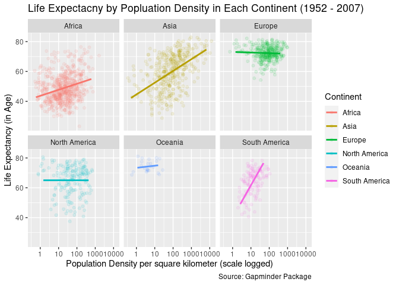
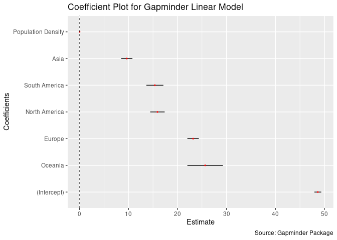

Homework 08: Part 1. Analysis of Gapminder
================
Boseong Yun
2020-06-01

# Part 1. Exploring the Gapminder Data

  - Exploratory Data Analysis: The following graph shows that population
    density is positively associated with higher life expectancy in
    Africa, Asia, and South America. In other continents, the impact of
    population density on life expectancy seems to be meager.

<!-- -->

  - Exploratoray Data Analysis with statistical information: The
    following coeffcient plot shows that continent variables have strong
    impact on the life expectancy. The population density variable,
    however, seems to have limited impact. All of the variables are
    statistically significant with confidence intervals ranging on
    strcitly positive value. (Although the coefficient on population
    density is hardly visible on this plot, its confidence intervals lie
    strictly above zero)

<!-- -->

  - Regression: The following regression output table shows that
    population density increases life expectancy only slightly holding
    continent variables constant. On the other hand, the coefficients on
    the continent varibles show that Asia, Europe, North America,
    Oceania, and South America increases the life expectancy by 9.65,
    23.18 15.90, 25.64, and 15.38 years respectively. These results
    imply that other factors such as GDP, infrastructure, and
    availability of food and medical services in each continent could
    have impact on life
expectancy.

| Variable           | Estimate | Standard Error |   T Stat | P-Value | Lower 95% | Upper 95% |
| :----------------- | -------: | -------------: | -------: | ------: | --------: | --------: |
| (Intercept)        |  48.6527 |         0.3565 | 136.4548 |       0 |   47.9534 |   49.3520 |
| Population Density |   0.0045 |         0.0004 |  10.4959 |       0 |    0.0037 |    0.0053 |
| Asia               |   9.6468 |         0.5849 |  16.4934 |       0 |    8.4996 |   10.7940 |
| Europe             |  23.1824 |         0.5955 |  38.9289 |       0 |   22.0144 |   24.3504 |
| North America      |  15.9023 |         0.7528 |  21.1256 |       0 |   14.4259 |   17.3788 |
| Oceania            |  25.6432 |         1.8498 |  13.8629 |       0 |   22.0151 |   29.2713 |
| South America      |  15.3764 |         0.8865 |  17.3457 |       0 |   13.6377 |   17.1151 |

Table 1: Regression Output on Life
    Expectancy

    ## ─ Session info ───────────────────────────────────────────────────────────────
    ##  setting  value                               
    ##  version  R version 3.6.3 (2020-02-29)        
    ##  os       Red Hat Enterprise Linux 8.1 (Ootpa)
    ##  system   x86_64, linux-gnu                   
    ##  ui       X11                                 
    ##  language (EN)                                
    ##  collate  en_US.UTF-8                         
    ##  ctype    en_US.UTF-8                         
    ##  tz       America/Chicago                     
    ##  date     2020-06-01                          
    ## 
    ## ─ Packages ───────────────────────────────────────────────────────────────────
    ##  package      * version   date       lib source        
    ##  assertthat     0.2.1     2019-03-21 [2] CRAN (R 3.6.3)
    ##  backports      1.1.5     2019-10-02 [2] CRAN (R 3.6.3)
    ##  boot           1.3-24    2019-12-20 [2] CRAN (R 3.6.3)
    ##  brnn           0.8       2020-01-08 [1] CRAN (R 3.6.3)
    ##  broom        * 0.5.5     2020-02-29 [2] CRAN (R 3.6.3)
    ##  callr          3.4.3     2020-03-28 [2] CRAN (R 3.6.3)
    ##  cellranger     1.1.0     2016-07-27 [2] CRAN (R 3.6.3)
    ##  cli            2.0.2     2020-02-28 [2] CRAN (R 3.6.3)
    ##  colorspace     1.4-1     2019-03-18 [2] CRAN (R 3.6.3)
    ##  countrycode  * 1.1.2     2020-04-22 [1] CRAN (R 3.6.3)
    ##  crayon         1.3.4     2017-09-16 [2] CRAN (R 3.6.3)
    ##  Cubist         0.2.3     2020-01-10 [1] CRAN (R 3.6.3)
    ##  data.table     1.12.8    2019-12-09 [2] CRAN (R 3.6.3)
    ##  DBI            1.1.0     2019-12-15 [2] CRAN (R 3.6.3)
    ##  dbplyr         1.4.2     2019-06-17 [2] CRAN (R 3.6.3)
    ##  dendroTools  * 1.0.7     2020-01-07 [1] CRAN (R 3.6.3)
    ##  desc           1.2.0     2018-05-01 [2] CRAN (R 3.6.3)
    ##  devtools       2.2.2     2020-02-17 [2] CRAN (R 3.6.3)
    ##  digest         0.6.25    2020-02-23 [2] CRAN (R 3.6.3)
    ##  dplyr        * 0.8.5     2020-03-07 [2] CRAN (R 3.6.3)
    ##  ellipsis       0.3.0     2019-09-20 [2] CRAN (R 3.6.3)
    ##  evaluate       0.14      2019-05-28 [2] CRAN (R 3.6.3)
    ##  fansi          0.4.1     2020-01-08 [2] CRAN (R 3.6.3)
    ##  farver         2.0.3     2020-01-16 [2] CRAN (R 3.6.3)
    ##  forcats      * 0.5.0     2020-03-01 [2] CRAN (R 3.6.3)
    ##  Formula        1.2-3     2018-05-03 [2] CRAN (R 3.6.3)
    ##  fs             1.4.0     2020-03-31 [2] CRAN (R 3.6.3)
    ##  gapminder    * 0.3.0     2017-10-31 [2] CRAN (R 3.6.3)
    ##  generics       0.0.2     2018-11-29 [2] CRAN (R 3.6.3)
    ##  geonames     * 0.999     2019-02-19 [2] CRAN (R 3.6.3)
    ##  ggplot2      * 3.3.0     2020-03-05 [2] CRAN (R 3.6.3)
    ##  glue           1.3.2     2020-03-12 [2] CRAN (R 3.6.3)
    ##  gridExtra      2.3       2017-09-09 [2] CRAN (R 3.6.3)
    ##  gsw            1.0-5     2017-08-09 [1] CRAN (R 3.6.3)
    ##  gtable         0.3.0     2019-03-25 [2] CRAN (R 3.6.3)
    ##  haven          2.2.0     2019-11-08 [2] CRAN (R 3.6.3)
    ##  highr          0.8       2019-03-20 [2] CRAN (R 3.6.3)
    ##  hms            0.5.3     2020-01-08 [2] CRAN (R 3.6.3)
    ##  htmltools      0.4.0     2019-10-04 [2] CRAN (R 3.6.3)
    ##  htmlwidgets    1.5.1     2019-10-08 [2] CRAN (R 3.6.3)
    ##  httr           1.4.1     2019-08-05 [2] CRAN (R 3.6.3)
    ##  jsonlite       1.6.1     2020-02-02 [2] CRAN (R 3.6.3)
    ##  knitr        * 1.28      2020-02-06 [2] CRAN (R 3.6.3)
    ##  labeling       0.3       2014-08-23 [2] CRAN (R 3.6.3)
    ##  lattice        0.20-38   2018-11-04 [2] CRAN (R 3.6.3)
    ##  lazyeval       0.2.2     2019-03-15 [2] CRAN (R 3.6.3)
    ##  lifecycle      0.2.0     2020-03-06 [2] CRAN (R 3.6.3)
    ##  lubridate    * 1.7.4     2018-04-11 [2] CRAN (R 3.6.3)
    ##  magrittr       1.5       2014-11-22 [2] CRAN (R 3.6.3)
    ##  Matrix         1.2-18    2019-11-27 [2] CRAN (R 3.6.3)
    ##  memoise        1.1.0     2017-04-21 [2] CRAN (R 3.6.3)
    ##  mgcv           1.8-31    2019-11-09 [2] CRAN (R 3.6.3)
    ##  MLmetrics      1.1.1     2016-05-13 [1] CRAN (R 3.6.3)
    ##  mnormt         1.5-6     2020-02-03 [2] CRAN (R 3.6.3)
    ##  modelr         0.1.6     2020-02-22 [2] CRAN (R 3.6.3)
    ##  munsell        0.5.0     2018-06-12 [2] CRAN (R 3.6.3)
    ##  nlme           3.1-144   2020-02-06 [2] CRAN (R 3.6.3)
    ##  oce            1.2-0     2020-02-21 [1] CRAN (R 3.6.3)
    ##  pillar         1.4.3     2019-12-20 [2] CRAN (R 3.6.3)
    ##  pkgbuild       1.0.6     2019-10-09 [2] CRAN (R 3.6.3)
    ##  pkgconfig      2.0.3     2019-09-22 [2] CRAN (R 3.6.3)
    ##  pkgload        1.0.2     2018-10-29 [2] CRAN (R 3.6.3)
    ##  plotly         4.9.2.1   2020-04-04 [1] CRAN (R 3.6.3)
    ##  plyr           1.8.6     2020-03-03 [2] CRAN (R 3.6.3)
    ##  prettyunits    1.1.1     2020-01-24 [2] CRAN (R 3.6.3)
    ##  processx       3.4.2     2020-02-09 [2] CRAN (R 3.6.3)
    ##  ps             1.3.2     2020-02-13 [2] CRAN (R 3.6.3)
    ##  psych          1.9.12.31 2020-01-08 [2] CRAN (R 3.6.3)
    ##  purrr        * 0.3.3     2019-10-18 [2] CRAN (R 3.6.3)
    ##  R6             2.4.1     2019-11-12 [2] CRAN (R 3.6.3)
    ##  randomForest   4.6-14    2018-03-25 [2] CRAN (R 3.6.3)
    ##  Rcpp           1.0.4     2020-03-17 [2] CRAN (R 3.6.3)
    ##  readr        * 1.3.1     2018-12-21 [2] CRAN (R 3.6.3)
    ##  readxl         1.3.1     2019-03-13 [2] CRAN (R 3.6.3)
    ##  remotes        2.1.1     2020-02-15 [2] CRAN (R 3.6.3)
    ##  reprex         0.3.0     2019-05-16 [2] CRAN (R 3.6.3)
    ##  reshape2       1.4.3     2017-12-11 [2] CRAN (R 3.6.3)
    ##  rjson          0.2.20    2018-06-08 [2] CRAN (R 3.6.3)
    ##  rlang          0.4.5     2020-03-01 [2] CRAN (R 3.6.3)
    ##  rmarkdown      2.1       2020-01-20 [2] CRAN (R 3.6.3)
    ##  rprojroot      1.3-2     2018-01-03 [2] CRAN (R 3.6.3)
    ##  rstudioapi     0.11      2020-02-07 [2] CRAN (R 3.6.3)
    ##  rvest        * 0.3.5     2019-11-08 [2] CRAN (R 3.6.3)
    ##  scales         1.1.0     2019-11-18 [2] CRAN (R 3.6.3)
    ##  sessioninfo    1.1.1     2018-11-05 [2] CRAN (R 3.6.3)
    ##  stringi        1.4.6     2020-02-17 [2] CRAN (R 3.6.3)
    ##  stringr      * 1.4.0     2019-02-10 [2] CRAN (R 3.6.3)
    ##  testthat       2.3.2     2020-03-02 [2] CRAN (R 3.6.3)
    ##  tibble       * 3.0.0     2020-03-30 [2] CRAN (R 3.6.3)
    ##  tidyr        * 1.0.2     2020-01-24 [2] CRAN (R 3.6.3)
    ##  tidyselect     1.0.0     2020-01-27 [2] CRAN (R 3.6.3)
    ##  tidyverse    * 1.3.0     2019-11-21 [2] CRAN (R 3.6.3)
    ##  truncnorm      1.0-8     2018-02-27 [1] CRAN (R 3.6.3)
    ##  usethis        1.5.1     2019-07-04 [2] CRAN (R 3.6.3)
    ##  vctrs          0.2.4     2020-03-10 [2] CRAN (R 3.6.3)
    ##  viridis        0.5.1     2018-03-29 [2] CRAN (R 3.6.3)
    ##  viridisLite    0.3.0     2018-02-01 [2] CRAN (R 3.6.3)
    ##  withr          2.1.2     2018-03-15 [2] CRAN (R 3.6.3)
    ##  xfun           0.12      2020-01-13 [2] CRAN (R 3.6.3)
    ##  xml2         * 1.3.0     2020-04-01 [2] CRAN (R 3.6.3)
    ##  yaml           2.2.1     2020-02-01 [2] CRAN (R 3.6.3)
    ## 
    ## [1] /home/boseongyun/R/x86_64-redhat-linux-gnu-library/3.6
    ## [2] /usr/lib64/R/library
    ## [3] /usr/share/R/library
